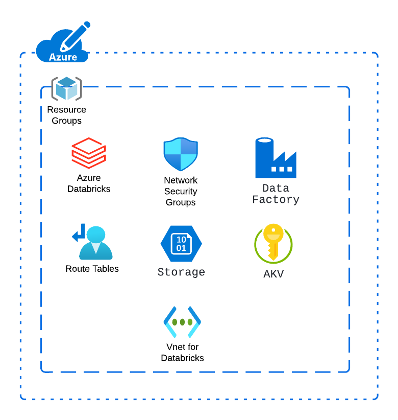
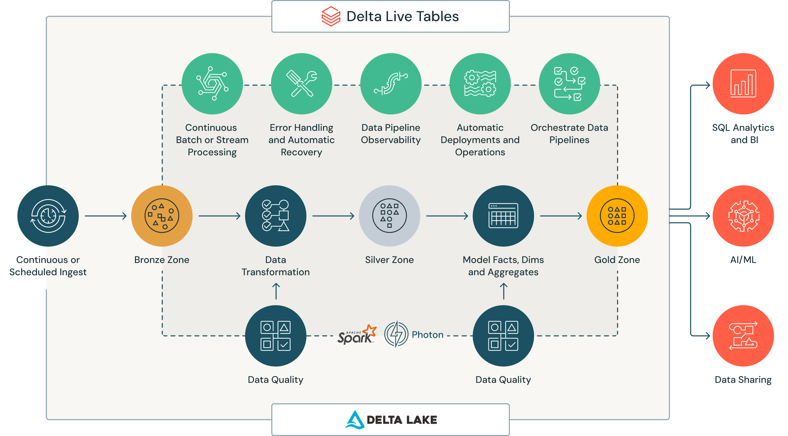
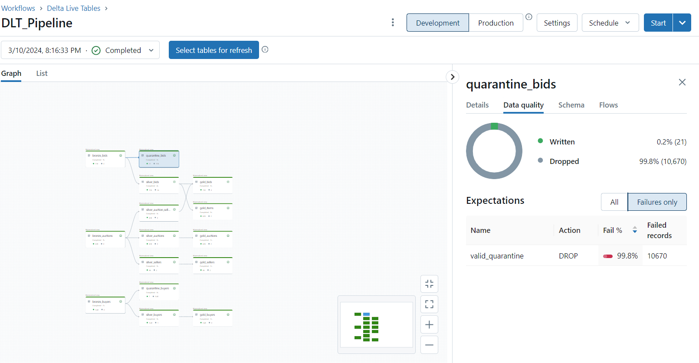

# Git Hub Terraform

The project has the following features:

- Use a Service Principal to authenticate to Azure services.
- Deploy a remote state bucket for Terraform on Azure using the  `Deploy Terraform State Bucket` workflow.
- Deploy Terraform infrastructure on Azure upon creation of a new Release on GitHub.

The repository requires the following secrets to be set:

- `ARM_CLIENT_ID`
- `ARM_CLIENT_SECRET`
- `ARM_TENANT_ID`
- `ARM_SUBSCRIPTION_ID`

## How is it structure?

Everything comes from Terraform (or almost 😉), the Terraform code is based on what is published by  [Databrick](https://github.com/databricks/terraform-databricks-examples/tree/main/examples/adb-lakehouse) with some small and powerful additions.

[Image reference](https://github.com/databricks/terraform-databricks-examples/tree/main/examples/adb-lakehouse)

What did I change:
* Remove Data Factory (is not really necessary).
* Added more data lakes, instead of thinking of folders, I formulated my solution based on containers (bronze, silver, gold)
* Added an Application and Managed Identity for mounting our containers in Databricks.
* Mounted my Azure DevOps repo in databricks, as well as the necessary credentials.

## Framework for Data Engineering

The framework I used is a Lakehouse architecture using the Medallion Architecture.

[Image reference](https://www.databricks.com/glossary/medallion-architecture)

Adding a phase between the bronze and silver layer for quarantine data, we don't want to just drop the rows that doesn't comply with our quality guidelines.

In our framework I also took into consideration:

1. Data Quality Checks
2. Data Lineage
3. Metadata Management
4. Maintenance (Vacuum and Optimize)
5. Our Reporting Layer can be served as a Star Schema (it is much faster!)

## What about the Data Pipeline?

I really focused on making a Delta Live Pipeline in Databricks (find the code in the folder "code-repo"), the reason is because really making a **Production Ready Pipeline** involves a complex engineering process, and DLT comes to the rescue:

[Image reference](https://www.databricks.com/product/delta-live-tables)

This is how our pipeline looks in Databricks:

